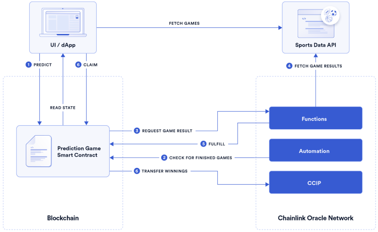

# Rugby Prediction Game

> **Note**
>
> _This demo represents an educational example to use a Chainlink system, product, or service and is provided to demonstrate how to interact with Chainlink’s systems, products, and services to integrate them into your own. This template is provided “AS IS” and “AS AVAILABLE” without warranties of any kind, it has not been audited, and it may be missing key checks or error handling to make the usage of the system, product or service more clear. Do not use the code in this example in a production environment without completing your own audits and application of best practices. Neither Chainlink Labs, the Chainlink Foundation, nor Chainlink node operators are responsible for unintended outputs that are generated due to errors in code._

This project has been developed for educational purposes only and is not meant to be used for gambling.

This project demostrates how to build a smart contract based application using real time sports data via [Chainlink Functions](https://docs.chain.link/chainlink-functions).

Additionally, the project showcases how to send automatic payouts using [Chainlink Automation](https://chain.link/automation) and how to transfer tokens cross-chain using [Chainlink CCIP](https://chain.link/cross-chain).

## Requirements

- Node.js version [18](https://nodejs.org/en/download/) or higher

## Getting Started

Clone the repo:

```bash
git clone https://github.com/smartcontractkit/prediction-game
```

It contains two separate projects:

- [`contracts`](./contracts/) - the smart contracts
- [`app`](./app/) - the frontend

Navigate to each directory and follow the instructions in their respective README files, starting with the contracts.

## Solution Overview

<br>

Code references:

1. Predict game result: [PredictionGame.sol#L116](./contracts/contracts/SportsPredictionGame.sol#L116)
2. Check for finished games: [PredictionGame.sol#379](./contracts/contracts/SportsPredictionGame.sol#L379)
3. Request game result: [ResultsConsumer.sol#L65](./contracts/contracts/ResultsConsumer.sol#L65)
4. Fetch game result: [sports-api.js#L63](./contracts/sports-api.js#L63)
5. Fulfill game result request [ResultsConsumer.sol#L105](./contracts/contracts/ResultsConsumer.sol#L105)
6. Claim winnings [SportsPredictionGame.sol#L151](./contracts/contracts/SportsPredictionGame.sol#L151)<br>
   6.1 Transfer winnings [NativeTokenSender.sol#L66](./contracts/contracts/ccip/NativeTokenSender.sol#L66)

## Resources

- [Chainlink Functions Docs](https://docs.chain.link/chainlink-functions)
- [Chainlink Automation Docs](https://docs.chain.link/chainlink-automation/introduction)
- [Chainlink CCIP Docs](https://docs.chain.link/ccip)

